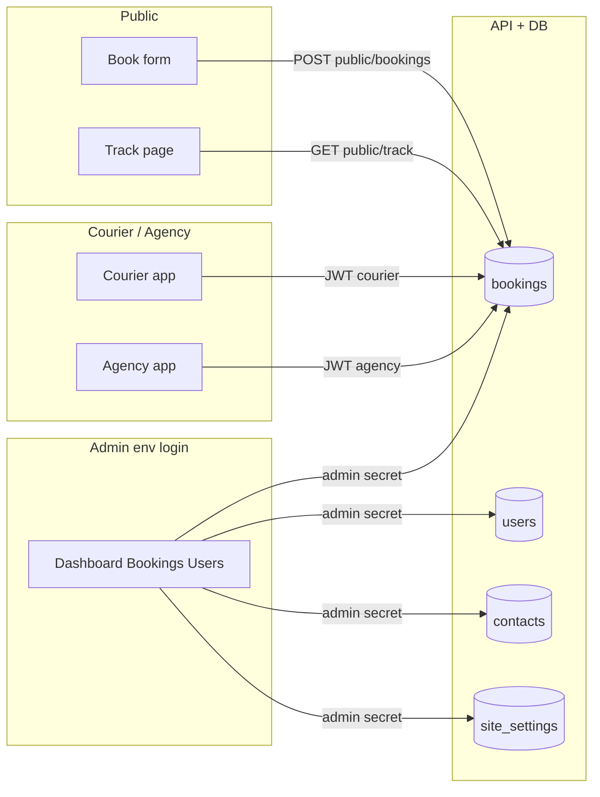

# Quadrato Cargo — roles, admin powers, and data flows

This document describes **who can do what**, which **data** lives where, and how **bookings** move through the system. It matches the current codebase (Next.js app + Express API + MongoDB).

---

## 1. User roles (MongoDB `users` collection)

| Role | Purpose |
|------|---------|
| **customer** | Public website account: profile, own bookings, pickup OTP view, PDFs when allowed. |
| **staff** | Internal team account created in Admin → Users. Same password system as customers if they use `/public/login` (JWT). **Does not** replace env-based admin panel login (see §2). |
| **courier** | Field user: sees assigned jobs, verifies pickup OTP, starts job, delivery flow in **Courier** UI. |
| **agency** | Partner hub: sees bookings assigned to their email, can update limited booking fields, handover verification. |

Roles are stored on each user document (`role`). Admins **create** courier, agency, and staff users from the admin UI (API: `POST /api/admin/users/courier`, `.../agency`, `.../staff`).

---

## 2. Admin panel (who logs in)

- **URL:** `/admin` (e.g. Dashboard, Bookings, Users, …).
- **Browser gate:** Next.js middleware requires the **admin auth cookie** (see `ADMIN_COOKIE_NAME` / `qc_admin_auth`).
- **Login:** `POST /api/admin/auth/login` checks credentials against **environment variables** `ADMIN_EMAIL` and `ADMIN_PASSWORD` only. There is **no** MongoDB lookup for admin login today.
- **Server actions / server fetches:** The Next app calls the API with header **`x-admin-secret`** (`ADMIN_API_SECRET` on the server). That is how “admin” mutations run from the UI.

**Important:** Copy on the login page that mentions “team accounts” refers to **users you create in Admin → Users** (staff/courier/agency/customer). Those accounts use **`/public/login`** (JWT), not the `/admin/login` env-based login, unless you extend the backend to support shared admin login.

---

## 3. What the admin can do (by area)

### 3.1 Dashboard (`/admin/dashboard`)

- View **counts**: users, contacts, bookings, “active pipeline” (not delivered/cancelled).
- **Bookings by status** chart (from `GET /api/admin/overview`).
- **Activity:** new users / contacts / bookings in last 24h and 7d.
- **Recent** contacts, bookings, users with links to detail pages.

### 3.2 Reports (`/admin/reports`)

- Monthly aggregates and breakdowns from `GET /api/admin/reports/monthly`.

### 3.3 Data & site (`/admin/settings`)

- **CSV-style exports** (links; session must be logged in).
- **Site settings** (saved to DB, used on public site + PDFs): announcement bar, **public phone & email**, PDF branding, **public tracking page** toggles (what customers see on Track).

### 3.4 Users (`/admin/users`)

- List/search users.
- **Create:** staff, courier, agency (dedicated forms → API).
- **Edit:** name, email, role, active flag, courier on-duty, password reset fields.
- **Delete** user.
- Open a user to see linked bookings when exposed by API.

### 3.5 Contacts (`/admin/contacts`)

- List/search **contact form** submissions (`POST /api/public/contact`).
- View/edit/delete a single contact.

### 3.6 Bookings (`/admin/bookings`)

- **Search/filter** by text, status, route (domestic/international), guest vs linked account.
- **Quick filters** and **open by reference** (tracking ID, barcode, internal id).
- **Per booking** (`/admin/bookings/[id]`):
  - **Tracking & dispatch:** status, consignment / tracking id, **public** customer note, operational log, internal notes, **agency** and **courier** assignment.
  - **Customer timeline:** quick card for current step + full timeline overrides (what shows on public Track).
  - **Customer view:** sender/recipient **name, email, phone** (merge API).
  - **Invoice PDF:** line items, currency, totals, **allow customer invoice PDF** flag.
  - **Pickup & details:** collection mode, dates/slots, pickup notes, **sender address** (postal/ZIP, etc.), link booking ↔ customer user, **full JSON payload** replace/merge.

**Booking APIs (admin secret):**

| Action | API (conceptually) |
|--------|----------------------|
| List / get | `GET /api/admin/bookings`, `GET /api/admin/bookings/:id` |
| Resolve reference | `GET /api/admin/bookings/resolve` |
| Status, notes, agency | `PATCH .../controls` |
| Timeline overrides | `PATCH .../timeline-overrides` |
| Payload merge (contacts, pickup, address) | `PATCH .../data` with `merge: true` |
| Full payload replace | `PATCH .../data` without merge |
| Invoice | `PATCH .../invoice` |
| Link customer | `PATCH .../link-user` |
| Assign courier | `PATCH .../assign-courier` |
| Delete | `DELETE .../bookings/:id` |

---

## 4. Customer (public account) flow

| Step | Where | API |
|------|--------|-----|
| Register / login | `/public/register`, `/public/login` | `POST /api/auth/register`, `login` |
| Profile | `/public/profile` | `GET/PATCH /api/users/me` |
| List own bookings | Profile | `GET /api/users/me/bookings` |
| Booking detail, OTP, PDFs | `/public/profile/booksdetels/[id]` | `GET /api/users/me/bookings/:id`, pickup OTP endpoint |
| Book without account | `/public/book` | `POST /api/public/bookings` (optional JWT → links `userId`) |
| Contact | `/public/contact` | `POST /api/public/contact` |
| Track (no login) | `/public/tsking` | `GET /api/public/track/:reference` |
| Site copy / footer / announcement | All public pages | `GET /api/public/site-settings` |

Customers **do not** see admin-only fields (internal notes, raw ops log unless exposed by site settings).

---

## 5. Courier flow

| Step | Where | API |
|------|--------|-----|
| Home / job list | `/courier` | `GET /api/courier/me/bookings` |
| Job detail | `/courier/bookings/[id]` | `GET /api/courier/me/bookings/:id` |
| On duty / status | Courier UI | `GET/PATCH /api/courier/me/status` |
| Enter pickup OTP | Courier UI | `POST /api/courier/me/bookings/:id/verify-pickup-otp` |
| Start job | Courier UI | `POST /api/courier/me/bookings/:id/start-job` |

Couriers only see bookings **assigned to them** (`courierId`) and within allowed statuses (see `courier.routes.js` + booking repo).

---

## 6. Agency flow

| Step | Where | API |
|------|--------|-----|
| Dashboard / list | `/agency` | `GET /api/agency/me/bookings` (and `.../public/bookings` alias) |
| Update booking (scoped) | Agency UI | `PATCH /api/agency/me/bookings/:id` |
| Handover OTP | Agency UI | `POST /api/agency/verify-handover` |

Agency users see bookings where **`assignedAgency`** matches their **login email** (or as implemented in `booking-repo` / controller).

---

## 7. End-to-end booking data flow (simplified)

1. **Customer or guest** submits booking → document in **`bookings`** with `payload` (sender, recipient, shipment, pickup fields), `status` (e.g. `submitted`), OTP fields for pickup.
2. **Admin** searches booking → updates **status**, **consignment number**, **public note**, assigns **agency** / **courier**, edits **pickup** and **invoice**, **timeline** for customer view.
3. **Courier** verifies **pickup OTP** → status moves toward picked up / in transit (per your business rules in controllers).
4. **Customer** (if linked or owns booking) sees updates on **Track** and in **profile**; may download **tracking** and **invoice** PDFs (same page format) when flags and OTP rules allow.

---

## 8. Main collections (mental model)

| Collection | Written by | Read by |
|------------|------------|---------|
| `users` | Register, admin user CRUD | Auth, profile, admin lists |
| `bookings` | Public book, admin patches, courier/agency scoped patches | Admin, customer profile, courier, agency, public track |
| `contacts` | Public contact form | Admin |
| `site_settings` | Admin site settings | Public `site-settings`, PDF generation |

---

## 9. Environment variables (admin-related)

Typical server `.env` names (see `server/src/config/env.js` and app):

- `ADMIN_EMAIL`, `ADMIN_PASSWORD` — **only** pair accepted at `/api/admin/auth/login`.
- `ADMIN_API_SECRET` — required on **`x-admin-secret`** for all `/api/admin/*` data routes (except auth routes as defined in `app.js`).
- `ADMIN_COOKIE_NAME` — admin session cookie name (must align with Next middleware).

---

## 10. Quick reference URLs

| Audience | Base paths |
|----------|------------|
| Admin | `/admin/login`, `/admin/dashboard`, `/admin/bookings`, `/admin/users`, `/admin/contacts`, `/admin/settings`, `/admin/reports` |
| Customer | `/public/login`, `/public/register`, `/public/profile`, `/public/book`, `/public/tsking` |
| Courier | `/courier`, `/courier/bookings/[id]` |
| Agency | `/agency` |

---

*Generated from the Quadrato Cargo repository structure. If behavior diverges after code changes, update this file or the code comments.*
